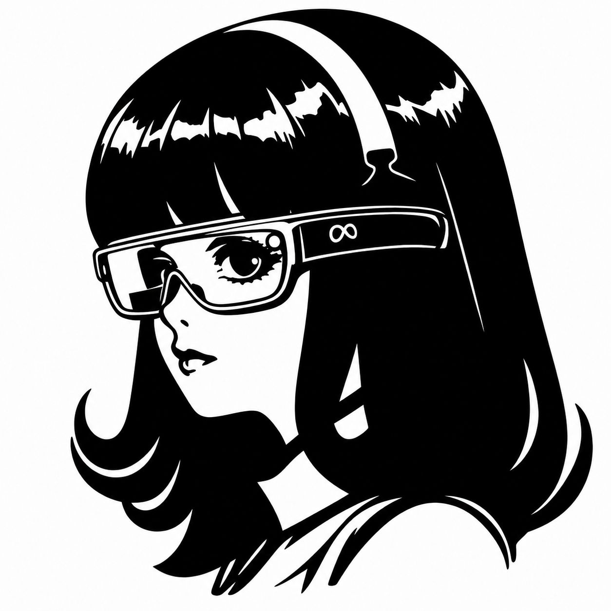

<p align="center">
  <picture>
    <source media="(prefers-color-scheme: dark)" srcset="assets/logo-dark.png">
    <source media="(prefers-color-scheme: light)" srcset="assets/logo-light.png">
    
  </picture>
</p>

<h1 align="center">Glass agent</h1>

<p align="center"><em>(formerly: Pharos)</em></p>

<p align="center">
  A voice AI companion for Meta Ray-Ban Display smart glasses,<br>
  powered by <a href="https://github.com/NousResearch/hermes-agent">Hermes Agent</a>.
</p>

## Why This Project

Meta Ray-Ban Display ships with Meta AI built in, but it's locked to Meta's own assistant flow. Glass agent opens the glasses to whatever AI runtime you choose — in this repo's reference setup, that runtime is **Hermes Agent**, a self-hosted multi-model AI agent.

The logo is intentional: Hermes the Greek messenger god, wearing smart glasses. The whole project is about giving Hermes — your own AI runtime, with your own memory, tools, and personality — a pair of eyes and a voice in the physical world.

> ⚠️ Note: this project does **not** use OpenClaw or any other AI runtime. The agent layer is specifically Hermes. If you want to plug in a different runtime, you'll need to replace the `run_hermes()` call in `bridge.py`.

## Architecture

```
[Glasses mic / cam / speaker]
            ⇅
   [iPhone — Glass agent]
            ⇅  WebSocket (LAN or Tailscale)
        [Mac — bridge.py]
            ⇅  subprocess
       [Hermes Agent CLI]
            ⇅
   [LLMs · MCP tools · long-term memory]
```

- **Glasses** — voice input, optional photo capture, audio output
- **iPhone (Glass agent)** — wake-word detection, speech-to-text, session management, audio playback
- **Mac bridge** — routes prompts to Hermes, streams replies back, generates TTS via edge-tts
- **Hermes Agent** — your AI runtime: LLM orchestration, MCP tool calling, memory, profiles
- **Network** — WebSocket on local LAN or Tailscale; no cloud dependency for the bridge itself

## Features

### Voice interaction
- **Customizable wake words** — defaults are `"blue"` and `"liveblue"`, but you can set them to anything in the app's settings (multiple languages supported)
- Two response modes triggered by different wake words:
  - *Brief* — single-sentence reply, then auto-returns to listening
  - *Continuous* — extended conversation mode
- On-device speech recognition (Apple's `SFSpeechRecognizer`)
- **Auto language** — STT locale follows the iOS system language (Korean, English, Japanese, Chinese, any locale supported by `SFSpeechRecognizer`), with `en-US` fallback
- Edge-TTS audio response played through the glasses' speakers

### Hermes integration
- Each user turn is forwarded to Hermes via the CLI (`hermes --profile blue -z <text> --yolo`)
- The bridge uses a dedicated **`blue` profile** in Hermes, configured for short voice-friendly replies
- **Conversation context preserved within a WebSocket session** — the last 10 turns are prepended on each new prompt so Hermes stays coherent
- **Long-term memory** — at session end, key facts are extracted and persisted to `~/.pharos/memories.json`, then auto-loaded into future prompts
- (Roadmap) `~/.hermes/ar/ar-knowledge-steward/` will let other Hermes agents drop shared context here to be read in

### Glasses integration (Meta Wearables DAT SDK)
- BLE pairing and session management via `MWDATCore` / `MWDATCamera`
- Camera capture from the glasses
- Photo streaming back to the phone

### Other goodies
- A separate **Glass agent MCP server** (`~/projects/pharos-mcp/`, historic directory name) exposes voice sessions, memory, Xcode build, and device install as Hermes tools — registered with the prefix `pharos:` for backward compatibility (`pharos:list_sessions`, `pharos:search_memory`, `pharos:build`, etc.)
- Automatic WebSocket reconnect on network drop or screen lock
- Persistent audio session for background operation
- Ping keepalive every 15 s; 5-minute inactivity session timeout

## Tech Stack

- **iOS app** — Swift, SwiftUI, AVFoundation, Speech framework, iOS 17.0+
- **Glasses SDK** — Meta Wearables DAT (`MWDATCore`, `MWDATCamera`)
- **Bridge** — Python, FastAPI/uvicorn, edge-tts (lives in a separate `PharosBridge` directory, not this repo)
- **AI runtime** — Hermes Agent (multi-model: Claude, GPT, Gemini, etc., chosen per-profile in Hermes itself)

## Requirements

- iOS 17.0+ device
- Meta Ray-Ban **Display** smart glasses (other Ray-Ban Meta / Oakley HSTN models are *not* supported by the DAT SDK)
- A paid Apple Developer Program membership (for Associated Domains, required by Meta's registration flow)
- A Mac always running:
  - the Glass agent bridge server
  - Hermes Agent CLI (`~/.local/bin/hermes`) with at least one configured profile
- Tailscale (or any other way to expose the Mac's WebSocket port over the internet, if you want to use the glasses away from home)

## Setup

This repo intentionally does **not** include credentials. To build for yourself:

1. Register your own app in the [Meta Wearables Developer Center](https://developers.meta.com/wearables/) and publish at least one version to a release channel.
2. In `Pharos/Info.plist`, replace `YOUR_META_CLIENT_TOKEN_HERE` with your Client Token, and update `MetaAppID`, `TeamID`, and `AppLinkURLScheme`.
3. Set your Bundle ID and Team ID in the Xcode project.
4. Host an `apple-app-site-association` file on your HTTPS domain (e.g. a GitHub Pages user site) that references `<TeamID>.<BundleID>`.
5. Add an **Associated Domains** capability in Xcode: `applinks:<your-aasa-host>`.
6. Install and configure Hermes Agent on your Mac, with a profile named `blue` (or change the profile name in `bridge.py`).
7. Run the bridge on the Mac (`python3 bridge.py`), preferably as a `launchd` agent.

## Project Status (2026-06)

- ✅ Wake-word loop, voice chat, TTS playback, auto-reconnect, contextual memory
- ✅ Hermes integration with the `blue` profile, same-session context preserved
- ✅ Glass agent MCP server registered with Hermes (`pharos:*` tool prefix kept for backward compatibility)
- ⏳ Glasses registration flow — Apple/Meta setup complete, currently waiting on Meta backend sync so the Meta AI app surfaces the registration dialog
- ⏳ Once registration lands: glasses camera capture, photo-to-LLM context
- ⏳ Multilingual TTS (currently Korean voice fixed)

## App Store?

Honest answer: **not yet, and possibly never as a single-tap install.** Glass agent depends on a Mac running the bridge and a Hermes profile — that's a multi-machine setup, and Apple App Store reviewers expect "out of the box" usability.

Realistic paths if distribution becomes a goal:
- **TestFlight** for friends/testers who are willing to set up their own Mac bridge
- **Cloud-hosted bridge** (we run it, users bring their own LLM keys or pay a subscription) — biggest refactor, removes Mac dependency
- **Stay self-hosted** — best for hobbyists who already have a personal server, never goes to the App Store

For now this repo is sized for one person (the author) with optional copies for close friends. If broader distribution ever happens, the cloud-hosted route is the only realistic one.

## License

Personal use. Not affiliated with Meta, Apple, Anthropic, OpenAI, Google, or the Hermes Agent project.
